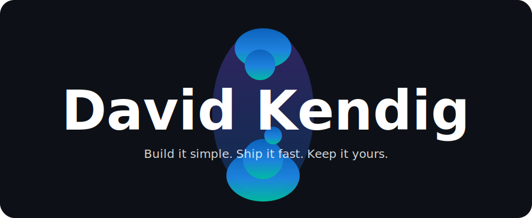

<p align="center">
  <picture>
    <source media="(prefers-color-scheme: dark)" srcset="./assets/header-dark.svg" />
    
  </picture>
</p>

<p align="center">
  <a href="https://davidkendig.info/"></a>
  <a href="https://www.linkedin.com/in/david-kendig"></a>
  <a href="https://github.com/DavidKendig"></a>
</p>

<p align="center">
  
</p>

## 👋 Hi there, I'm David Kendig

<table>
<tr>
<td width="60%" valign="top">

```yaml
name      :  David Kendig
city      :  Rochester
state     :  New York
country   :  United States 🇺🇸
timezone  :  UTC-5

site      :  davidkendig.info

focus     :  AI tools · Tabletop tech · Fantasy worlds
status    :  Building in the open
passion   :  Code · Homelab · TTRPGs 🎲
runs_on   :  Caffeine + curiosity ☕
```

</td>
<td width="40%" valign="top">

### 🛠️ What I Build

🤖 &nbsp;**AI tools** for local models

🐍 &nbsp;**Scripts & Programs** that kill busywork

🎲 &nbsp;**Virtual tabletops** and RPG resources

🌎 &nbsp;**Fantasy Worlds** for LARPS, RPGs, video games 🎮

</td>
</tr>
</table>

---

## 🥇 My Top Projects

**[Hephaestus](http://github.com/DavidKendig/Hephaestus)** - A self hosted AI GUI that runs entirely on your own hardware. It is a desktop app (React + Electron on the front, Python FastAPI on the back) that talks to any model you have installed in Ollama, with streaming replies and Markdown rendering. You can pull and manage models from inside the app, including a hardware compatibility report so you know what your machine can actually handle before you download 40GB. It does web search with cited sources when you want it, reads and writes documents (.docx, .xlsx, .pdf, plain text) so the model can summarize or convert your files, and keeps every conversation in a local SQLite database with AES-256-GCM encrypted histories and multi user accounts. Apart from the optional web search it runs completely offline, because I wanted the convenience of a modern AI chat interface without shipping my notes and documents off to somebody else's server. Startup is a double click on `start.bat` or `./start.sh` and it handles the dependencies, the UI build, and the backend for you.

**[Hephaestus - Obsidian Plugin](https://github.com/DavidKendig/HephaestusObsidianPlugin)** - The same idea brought into [Obsidian](https://obsidian.md/). It is a plugin that lets you chat with your local models (Ollama or LM Studio) without leaving your vault, with attachments, web search, and note integration, so the AI works with the notes you already have instead of in a seperate window.

**[EzVTT](https://github.com/DavidKendig/EzVTT)** - An easy to use VTT that you can quicky depoy to a VPS. The goal is a very simple UI for quickly setting up games without high technical knowlege by the GM, while being accessibleby everyone ovre the internet. Whle it is not intended to be as feature rich as avalible comercial options, it is quickly able to get a shared battlespace up and running and allows for much faster on the fly management. You can still download my original self hosted VTT [EZBattleMap](https://github.com/DavidKendig/EZBattleMap) for when you need an offline VTT for easy battlespace management. With the new capbabilities that AI provides for vibe codng since I completed my origional project, I am lookng to pour more of my energy into this one as I blive it allows for more features in the future than my origial and I don't really want to think of the five years I had to put into my original project when I had to do it by hand as a hobby.

---

## 🧪 Projects

| Project | Features |  |
| --- | --- | --- |
| [Aethernia Fantasy RPG Campaign](https://github.com/DavidKendig/AetherniaFantasyRPGCampaign) | A semi, system agnostic RPG setting | [](#) |
| [DavidKendig.info](https://github.com/DavidKendig/DavidKendig.info) | My personal website | [](#) [](#) [](#) |
| [EZBattleMap](https://github.com/DavidKendig/EZBattleMap) | My original self hosted VTT for offline battlespace management | [](#) |
| [EzVTT](https://github.com/DavidKendig/EzVTT) | Easy to use VTT that you can depoy to a VPS | [](#) [](#) [](#) |
| [Hephaestus](https://github.com/DavidKendig/Hephaestus) | A GUI for working with local and remote AI models | [](#) [](#) |
| [Hephaestus - Obsidian Plugin](https://github.com/DavidKendig/HephaestusObsidianPlugin) | Chat with local models (Ollama or LM Studio) inside your Obsidian vault, with attachments, web search, and note integration | [](#) |
| [OBS Live Dashboards](https://github.com/DavidKendig/OBS-Live-Dashboards) | Browser source dashboards and overlays for OBS livestreaming| [](#) |
| [RocPulse.com](https://github.com/DavidKendig/RocPulse.com) | Website for RocPulse | [](#) [](#) |
| [SwampDogGames.com](https://github.com/DavidKendig/SwampDogGames.com) | Website for Swamp Dog Games | [](#) [](#) |


---

## 📝 My Top Articles 

| | |
| --- | --- |
| Article A | Article K |
| Article B | Article L |
| Article C | Article M |
| Article D | Article N |
| Article E | Article O |
| Article F | Article P |
| Article G | Article Q |
| Article H | Article R |
| Article I | Article S |
| Article J | Article T |

[📚 All my articles are avalible on my website](https://davidkendig.info/)

---

## 📧 Connect
[](https://www.linkedin.com/in/david-kendig)